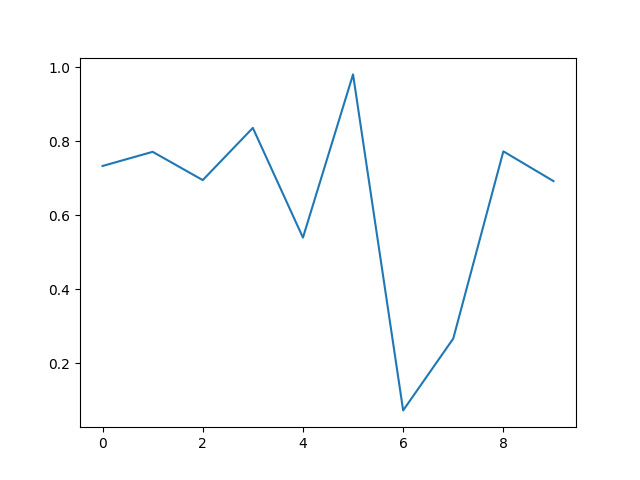
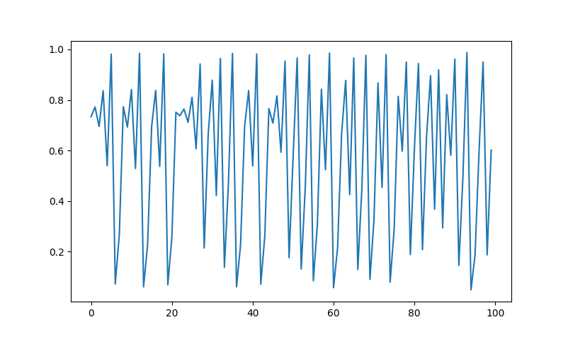
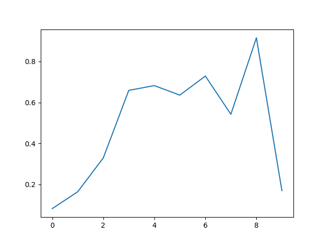
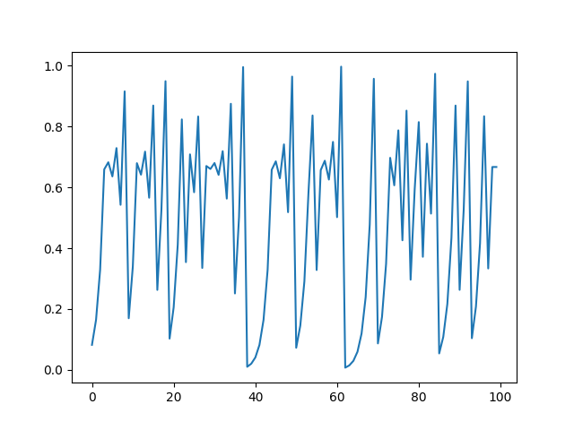
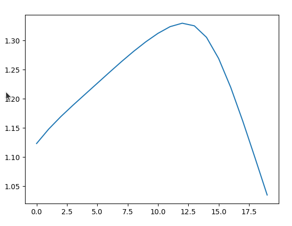
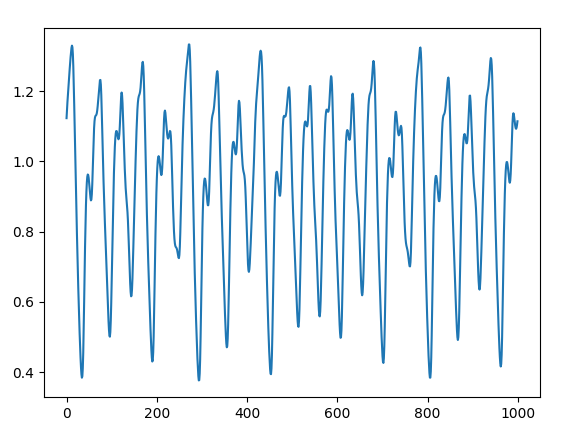

# Data Visualization

This directory contains scripts and plots for visualizing three classic chaotic and time-series datasets. Each dataset is generated in Python, then plotted at different time horizons so you can compare short-term structure with longer trajectories.

## Datasets

### Logistic Map

The logistic map is a one-dimensional discrete dynamical system defined by:

\[
x_{t+1} = a \cdot x_t \cdot (1 - x_t)
\]

With parameters `a = 3.95` and initial value `x₀ = 0.5422`, the system exhibits chaotic behavior. The first 100 transient steps are discarded before plotting. See `logistic.py` for the generator.

### Tent Map

The tent map is another piecewise-linear chaotic map on the unit interval:

\[
x_{t+1} =
\begin{cases}
\mu \cdot x_t & \text{if } x_t < 0.5 \\
\mu \cdot (1 - x_t) & \text{if } x_t \geq 0.5
\end{cases}
\]

Generated with `μ = 1.9999` and `x₀ = 0.5422`, with the first 100 steps removed. See `tentmap.py`.

### Mackey–Glass Equation

The Mackey–Glass system is a delay differential equation used to model physiological control systems:

\[
\frac{dx}{dt} = \frac{\beta \cdot x(t - \tau)}{1 + x(t - \tau)^n} - \gamma \cdot x(t)
\]

Simulated with `τ = 17`, `β = 0.2`, `γ = 0.1`, `n = 10`, and `dt = 1.0`, after discarding the first 100 steps. See `mackey.py`.

---

## Plots

Image names follow the pattern `{dataset}_{time_points}.png`: the prefix identifies the dataset, and the number is how many time steps are shown in the plot.

### Logistic Map

**10 time points** — `logistic_10.png`

**100 time points** — `logistic_100.png`

### Tent Map

**10 time points** — `tentmap_10.png`

**100 time points** — `tentmap_100.png`

### Mackey–Glass

**10 time points** — `mackeyglass_10.png`

**1000 time points** — `mackeyglass_1000.png`

---

## Files

| File | Description |
|------|-------------|
| `logistic.py` | Generates and plots logistic map data |
| `tentmap.py` | Generates and plots tent map data |
| `mackey.py` | Generates and plots Mackey–Glass time series |
| `images/` | Saved plot images for each dataset at various time horizons |
