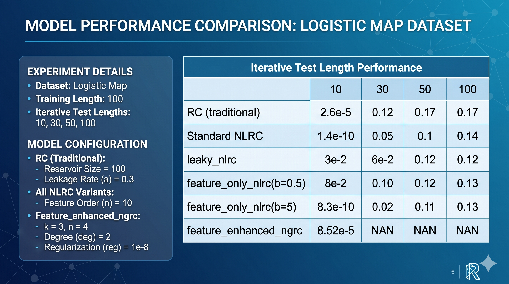
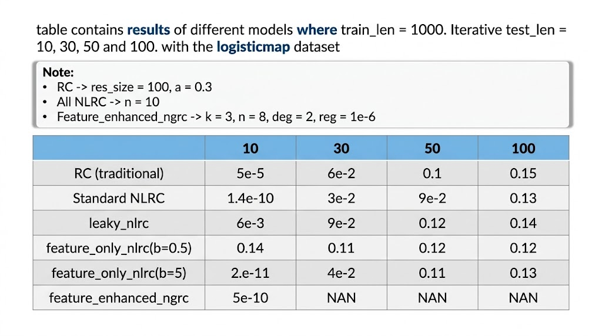
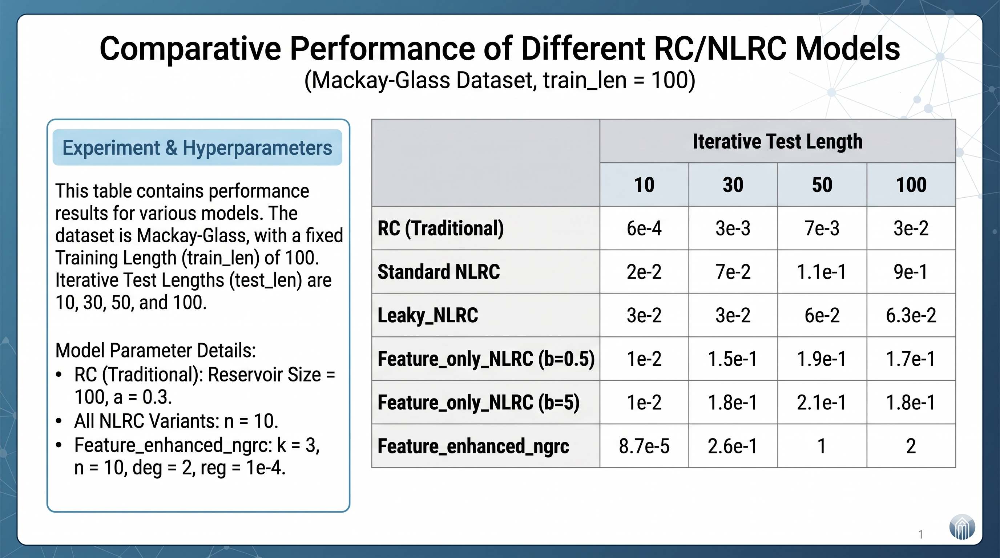
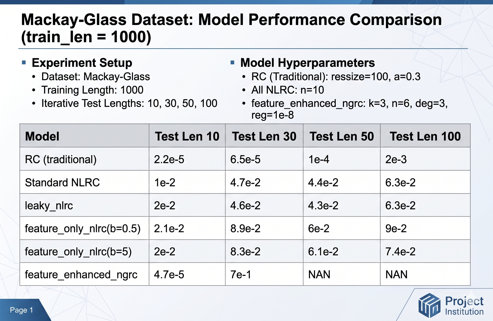

# May Results — Model Comparison on Chaotic Time Series

This directory contains benchmark results from May experiments comparing reservoir computing (RC) and next-generation reservoir computing (NLRC) variants on chaotic time-series datasets. Each image is a results table showing iterative prediction error across multiple test horizons.

## Experimental Setup

For every run:

- **Training length (`train_len`):** either 100 or 1000 time steps
- **Iterative test lengths (`test_len`):** 10, 30, 50, and 100 — models predict recursively, feeding each output back as the next input
- **Metric:** mean squared error (MSE); lower is better

## Models Compared

| Model | Description |
|-------|-------------|
| **RC (traditional)** | Standard echo-state / leaky integrator reservoir (`res_size = 100`, `a = 0.3`) |
| **Standard NLRC** | NLRC with GLS neuron feature extraction (`n = 10`) |
| **leaky_nlrc** | NLRC variant with leaky integration (`n = 10`) |
| **feature_only_nlrc (b = 0.5)** | Feature-only NLRC with threshold `b = 0.5` (`n = 10`) |
| **feature_only_nlrc (b = 5)** | Feature-only NLRC with threshold `b = 5` (`n = 10`) |
| **feature_enhanced_ngrc** | Polynomial feature-enhanced NGRC (`k`, `n`, `deg`, `reg` vary per experiment) |

## Datasets

### Logistic Map

Discrete chaotic map: \(x_{t+1} = a \cdot x_t \cdot (1 - x_t)\) with \(a = 3.95\), \(x_0 = 0.5422\).

### Mackey–Glass

Delay differential equation simulating a physiological control system, with delay \(\tau = 17\), \(\beta = 0.2\), \(\gamma = 0.1\), \(n = 10\).

---

## Results

### Logistic Map — `train_len = 100`

`logistic_map_100.png`

**Hyperparameters:** RC (`res_size = 100`, `a = 0.3`); all NLRC variants (`n = 10`); feature_enhanced_ngrc (`k = 3`, `n = 4`, `deg = 2`, `reg = 1e-8`).

| Model | 10 | 30 | 50 | 100 |
|-------|----|----|----|-----|
| RC (traditional) | 2.6e-5 | 0.12 | 0.17 | 0.17 |
| Standard NLRC | 1.4e-10 | 0.05 | 0.1 | 0.14 |
| leaky_nlrc | 3e-2 | 6e-2 | 0.12 | 0.12 |
| feature_only_nlrc (b = 0.5) | 8e-2 | 0.10 | 0.12 | 0.13 |
| feature_only_nlrc (b = 5) | 8.3e-10 | 0.02 | 0.11 | 0.13 |
| feature_enhanced_ngrc | 8.52e-5 | NAN | NAN | NAN |

---

### Logistic Map — `train_len = 1000`

`logistic_1000.jpeg`

**Hyperparameters:** RC (`res_size = 100`, `a = 0.3`); all NLRC variants (`n = 10`); feature_enhanced_ngrc (`k = 3`, `n = 8`, `deg = 2`, `reg = 1e-6`).

| Model | 10 | 30 | 50 | 100 |
|-------|----|----|----|-----|
| RC (traditional) | 5e-5 | 6e-2 | 0.1 | 0.15 |
| Standard NLRC | 1.4e-10 | 3e-2 | 9e-2 | 0.13 |
| leaky_nlrc | 6e-3 | 9e-2 | 0.12 | 0.14 |
| feature_only_nlrc (b = 0.5) | 0.14 | 0.11 | 0.12 | 0.12 |
| feature_only_nlrc (b = 5) | 2e-11 | 4e-2 | 0.11 | 0.13 |
| feature_enhanced_ngrc | 5e-10 | NAN | NAN | NAN |

---

### Mackey–Glass — `train_len = 100`

`mackay_100.png`

**Hyperparameters:** RC (`res_size = 100`, `a = 0.3`); all NLRC variants (`n = 10`); feature_enhanced_ngrc (`k = 3`, `n = 10`, `deg = 2`, `reg = 1e-4`).

| Model | 10 | 30 | 50 | 100 |
|-------|----|----|----|-----|
| RC (traditional) | 6e-4 | 3e-3 | 7e-3 | 3e-2 |
| Standard NLRC | 2e-2 | 7e-2 | 1.1e-1 | 9e-1 |
| leaky_nlrc | 3e-2 | 3e-2 | 6e-2 | 6.3e-2 |
| feature_only_nlrc (b = 0.5) | 1e-2 | 1.5e-1 | 1.9e-1 | 1.7e-1 |
| feature_only_nlrc (b = 5) | 1e-2 | 1.8e-1 | 2.1e-1 | 1.8e-1 |
| feature_enhanced_ngrc | 8.7e-5 | 2.6e-1 | 1 | 2 |

---

### Mackey–Glass — `train_len = 1000`

`mackay_1000.png`

**Hyperparameters:** RC (`res_size = 100`, `a = 0.3`); all NLRC variants (`n = 10`); feature_enhanced_ngrc (`k = 3`, `n = 6`, `deg = 3`, `reg = 1e-8`).

| Model | 10 | 30 | 50 | 100 |
|-------|----|----|----|-----|
| RC (traditional) | 2.2e-5 | 6.5e-5 | 1e-4 | 2e-3 |
| Standard NLRC | 1e-2 | 4.7e-2 | 4.4e-2 | 6.3e-2 |
| leaky_nlrc | 2e-2 | 4.6e-2 | 4.3e-2 | 6.3e-2 |
| feature_only_nlrc (b = 0.5) | 2.1e-2 | 8.9e-2 | 6e-2 | 9e-2 |
| feature_only_nlrc (b = 5) | 2e-2 | 8.3e-2 | 6.1e-2 | 7.4e-2 |
| feature_enhanced_ngrc | 4.7e-5 | 7e-1 | NAN | NAN |

---

## Files

| File | Description |
|------|-------------|
| `logistic_map_100.png` | Logistic map results, `train_len = 100` |
| `logistic_1000.jpeg` | Logistic map results, `train_len = 1000` |
| `mackay_100.png` | Mackey–Glass results, `train_len = 100` |
| `mackay_1000.png` | Mackey–Glass results, `train_len = 1000` |
